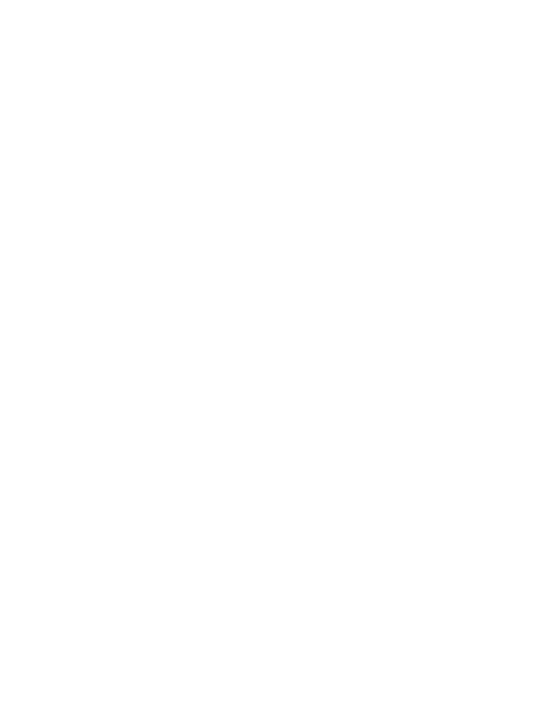

# Mpower fights substance abuse in New Hampshire.

## What is Mpower?
      
NH youth has one of the highest rates of substance abuse in the US. Narayan Sajeev, a junior at Nashua High School South, has witnessed this issue firsthand. To help chip away at substance abuse, Narayan made Mpower. Using Mpower, Narayan hopes to do his part in fighting the growing overdose epidemic.

## How does Mpower work?

Mpower uses strategies such as journals and quotes to help a person suffering from substance abuse regain control over their emotional wellbeing.

## How can I get started on Mpower?
      
The great news is that getting started on Mpower is free! All you have to do is create an account with [this link](http://www.mpowernh.com/signup "Create an account at Mpower"). 